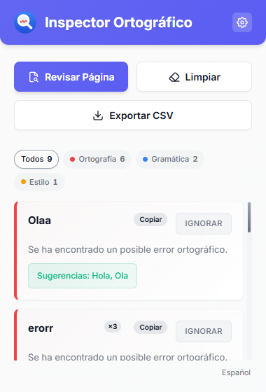
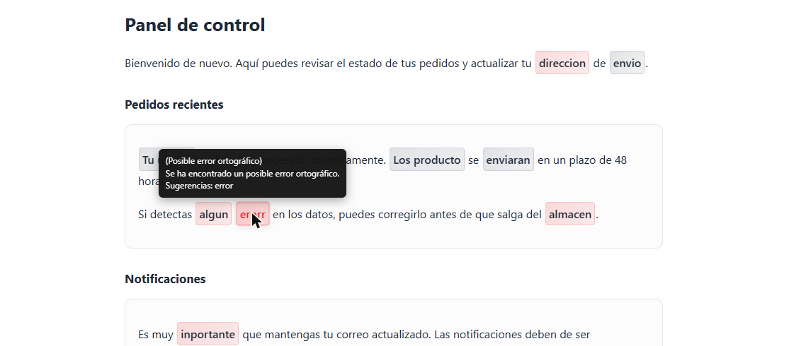
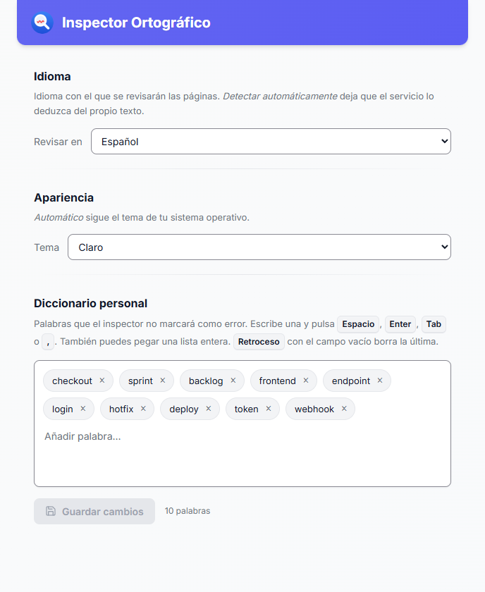
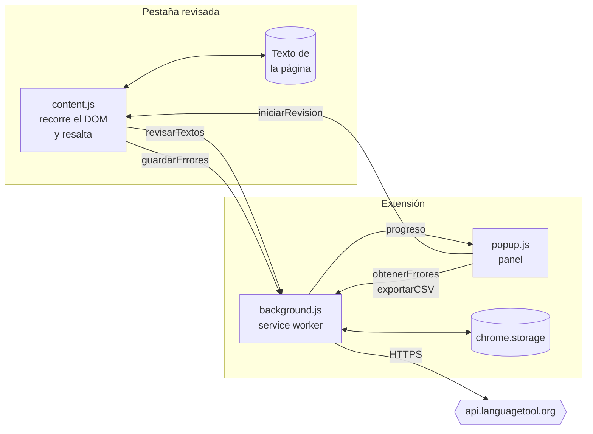
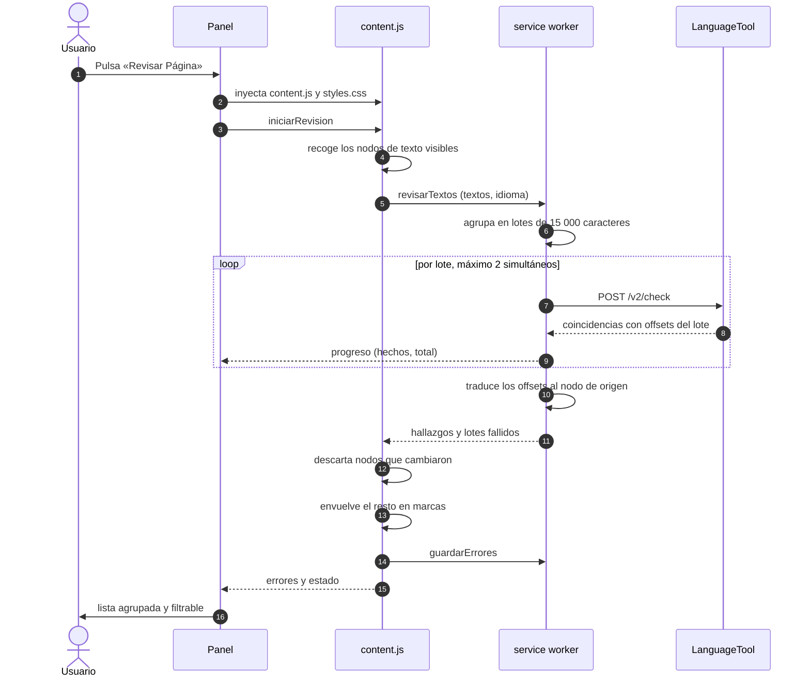

<div align="center">


# Inspector Ortográfico

**Revisa la ortografía y la gramática de cualquier página web, resalta los errores sobre la propia página y exporta un informe en CSV.**

[](https://developer.chrome.com/docs/extensions/mv3/intro/)
[](#)
[](LICENSE)

</div>

---

## Qué es

Una extensión de Chrome que analiza el texto visible de una página con
[LanguageTool](https://languagetool.org/) y te muestra los errores de dos formas
a la vez: **resaltados sobre la página**, para verlos en contexto, y **listados
en un panel**, para recorrerlos uno a uno.

Está pensada para quien necesita **revisar el texto de una aplicación web**
—equipos de QA, redacción y soporte— y no solo corregir lo que está escribiendo
en ese momento. Por eso incluye exportación a CSV, diccionario personal y
agrupación de errores repetidos.

## Características

| | |
|---|---|
| **Revisión de la página completa** | Analiza todo el texto visible, no solo los campos de formulario. |
| **Errores por categoría** | 🔴 Ortografía · 🔵 Gramática · 🟠 Estilo · ⚪ Otros (puntuación, mayúsculas). |
| **Agrupación de repetidos** | Una palabra que aparece 20 veces es **una** fila con contador, no 20. Al pulsarla saltas de una ocurrencia a la siguiente. |
| **Filtro y recuento** | Pastillas por categoría que además sirven de leyenda de colores. |
| **Diccionario personal** | Marca una palabra como correcta y deja de señalarse. Se sincroniza con tu cuenta de Chrome. |
| **Deshacer** | Si ignoras una palabra por error, puedes revertirlo. |
| **Copiar la corrección** | Deja `parrafo → párrafo` en el portapapeles, listo para pegar en un ticket. |
| **Exportación a CSV** | Informe con palabra, mensaje, sugerencias, categoría, URL y fecha. |
| **8 idiomas + detección automática** | Español, inglés (EE. UU. / Reino Unido), portugués (Brasil), francés, alemán e italiano. |
| **Navegable con teclado** | Toda la interfaz es accesible con `Tab` y `Enter`. |
| **Modo claro y oscuro** | Sigue el tema del sistema, o se fuerza desde las opciones. |

## Capturas

> Las imágenes se encuentran en [`docs/img/`](docs/img).

### Panel de errores



Los errores aparecen agrupados y filtrables. El contador `×3` indica cuántas
veces se repite esa palabra en la página.

### Errores resaltados sobre la página



Cada error se subraya con el color de su categoría. Al pasar el ratón se muestra
el motivo y las sugerencias.

### Diccionario personal



Las palabras ignoradas se gestionan como etiquetas: escribe y pulsa
`Espacio`, `Enter`, `Tab` o `,`.

## Instalación

Todavía no está publicada en la Chrome Web Store. Para instalarla manualmente:

1. **Descarga el repositorio**
   Pulsa **`< > Code`** → **`Download ZIP`**, o clónalo:
   ```bash
   git clone https://github.com/RafaelAlvarez29/Inspector-Ortografico.git
   ```

2. **Descomprímelo** en una carpeta estable (si luego la mueves o la borras, la
   extensión dejará de funcionar).

3. **Cárgalo en Chrome**
   - Abre `chrome://extensions`
   - Activa **Modo de desarrollador** (arriba a la derecha)
   - Pulsa **Cargar descomprimida** y selecciona la carpeta del proyecto

4. **Ánclala a la barra** con el icono de la pieza de puzle, para tenerla a mano.

> **Al actualizar:** pulsa el botón de recargar (🔄) en la tarjeta de la
> extensión **y recarga también las pestañas que tuvieras abiertas**. Si no, una
> página puede quedarse con la versión anterior del código inyectado.

## Uso

1. Abre la página que quieras revisar.
2. Pulsa el icono de la extensión y luego **Revisar Página**.
3. Los errores aparecen resaltados en la página y listados en el panel.

Desde el panel puedes:

| Acción | Cómo |
|---|---|
| Ir al error en la página | Pulsa la fila. Si la palabra se repite, cada pulsación salta a la siguiente ocurrencia. |
| Copiar la corrección | Botón **Copiar** de la fila. |
| Ignorar una palabra | Botón **Ignorar**. Se añade a tu diccionario personal. |
| Deshacer el ignorar | Botón **Deshacer** de la barra que aparece durante unos segundos. |
| Filtrar por categoría | Pulsa una de las pastillas de recuento. |
| Exportar el informe | **Exportar CSV**. |
| Limpiar los resaltados | **Limpiar**. |
| Cambiar de idioma | Icono ⚙ de la cabecera → sección **Idioma**. |
| Cambiar el tema | Icono ⚙ → **Apariencia**: automático, claro u oscuro. |
| Gestionar el diccionario | Icono ⚙ de la cabecera. |
| Volver de la configuración | Flecha ←, <kbd>Esc</kbd>, o al guardar. |

### El informe CSV

Una fila por error, con estas columnas:

| Columna | Contenido |
|---|---|
| `Palabra` | El texto marcado como erróneo. |
| `Mensaje` | Explicación de LanguageTool. |
| `Sugerencias` | Correcciones propuestas, separadas por comas. |
| `Categoria` | `typo`, `gramatica`, `estilo` u `otro`. |
| `URL` | Dirección de la página revisada. |
| `Fecha` | Marca de tiempo ISO 8601. |

Se genera con BOM UTF-8, de modo que Excel respeta las tildes al abrirlo.

## Privacidad

- **El texto visible de la página que revisas se envía a la API pública de
  LanguageTool** (`api.languagetool.org`) para su análisis. Es el único destino
  externo al que la extensión se conecta.
- **No se recoge ninguna analítica** ni se envía información a ningún otro
  servidor. No hay rastreadores ni recursos externos: la tipografía va
  empaquetada en la extensión.
- **Tu diccionario personal y el idioma elegido** se guardan en
  `chrome.storage.sync`, es decir, en tu cuenta de Chrome.
- **Los errores de cada pestaña** se guardan en `chrome.storage.session` y
  desaparecen al cerrar el navegador.

> ⚠️ No revises páginas con información confidencial. Su texto saldría hacia un
> servicio de terceros.

### Permisos y por qué

| Permiso | Para qué |
|---|---|
| `activeTab` + `scripting` | Inyectar el revisor **solo** en la pestaña activa y **solo** cuando pulsas «Revisar». La extensión no se ejecuta en segundo plano ni accede a páginas que no le pidas. |
| `storage` | Guardar el diccionario, el idioma y los resultados de la revisión. |
| `downloads` | Descargar el informe CSV. |
| `api.languagetool.org` | Enviar el texto a analizar. |

### Configuración

El idioma y el diccionario viven en una vista que **se desliza sobre el propio
panel** al pulsar el engranaje, sin abrir otra pestaña. La misma vista está
disponible como página independiente (clic derecho sobre el icono → Opciones, o
desde `chrome://extensions`); ambas montan el mismo componente.

## Desarrollo

### Requisitos

Node.js 20 o superior (se usa el ejecutor de pruebas integrado). La única
dependencia es `jsdom`, y solo para las pruebas.

```bash
npm install
npm test
```

> 77 pruebas. No requieren red ni navegador.

### Estructura

```
├── manifest.json           Configuración de la extensión (MV3)
├── background.js           Service worker: llamadas a la API y estado
├── content.js              Script de página: recorre el DOM y resalta
├── base.css                Tokens y primitivas compartidas por las dos pantallas
├── configuracion.css       Estilos de la vista de ajustes
├── popup.html/.js/.css     Panel de la extensión
├── options.html/.js/.css   La vista de ajustes como página independiente
├── styles.css              Estilos inyectados en la página revisada
├── lib/                    Lógica pura, sin DOM ni red (cubierta por pruebas)
│   ├── batching.js           Agrupa el texto en lotes y mapea los offsets
│   ├── languagetool.js       Cliente de la API con reintentos
│   ├── revision.js           Orquesta los lotes con concurrencia limitada
│   ├── agrupar.js            Agrupa errores repetidos y cuenta categorías
│   ├── render.js             Construye el DOM del panel sin innerHTML
│   ├── tooltip.js            Calcula la posición del globo de ayuda
│   ├── estado.js             Decide si los resultados siguen vigentes
│   ├── diccionario.js        Normaliza y deduplica palabras
│   ├── configuracion.js      Vista de ajustes, montada en el panel y en la página
│   ├── idiomas.js            Catálogo de idiomas
│   └── paginas.js            Qué páginas se pueden revisar
├── fonts/                  Tipografía Inter empaquetada
├── test/                   Pruebas (node:test + jsdom)
└── tools/                  Generación de los iconos
```

### Arquitectura

La extensión vive en tres contextos aislados que solo pueden hablar entre sí
mediante mensajes. Las etiquetas de las flechas son los nombres reales de los
mensajes del código:



**Por qué la red se hace desde el *service worker* y no desde la página:** así se
esquiva la política de seguridad de contenido del sitio revisado, que puede
bloquear peticiones salientes, y el control de ritmo queda en un único punto
para todas las pestañas.

### Flujo de una revisión



El paso 8 es la razón de que un fallo de red **no** se confunda con «sin
errores»: los lotes que fracasan se cuentan aparte y el panel avisa de que el
informe es parcial.

### Cómo se extrae el texto y se recuperan las posiciones

Enviar una petición por nodo de texto agotaría el límite de la API en cualquier
página real. Los nodos se concatenan en un solo lote separados por una línea en
blanco —para que LanguageTool no cruce reglas gramaticales entre textos que no
tienen relación— y después se traduce de vuelta cada posición:

```
Nodos      [ "Olaa mundo" ]  [ "esto es un erorr" ]  [ "ok" ]
                  │                    │                 │
                  └──────── concatenar con "\n\n" ────────┘
                                       ▼
Lote       "Olaa mundo\n\nesto es un erorr\n\nok"
offsets     0         10            23       30

LanguageTool devuelve   offset 23, longitud 5
                                 │
                   restar el inicio del nodo (12)
                                 ▼
Resultado   nodo 1, offset 11  →  "erorr"
```

Si una coincidencia cruzara el separador se descarta: significaría que abarca
dos nodos distintos y resaltarla corrompería el DOM.

### Los iconos

Se generan por código, sin dependencias:

```bash
python tools/generar-iconos.py
```

Las figuras se definen con funciones de distancia con signo y se dibujan a mayor
resolución para después reducirlas, lo que produce el suavizado. El PNG se
escribe directamente con `zlib`.

## Limitaciones conocidas

- **Límite de la API pública.** LanguageTool restringe las peticiones por
  dirección IP. En páginas muy extensas puede aparecer el aviso *«Revisión
  parcial»*: espera un minuto y vuelve a intentarlo.
- **Páginas dinámicas.** Si la página cambia su contenido mientras se revisa,
  los resultados de las zonas modificadas se descartan para no señalar texto
  correcto. Vuelve a revisar cuando termine de cargar.
- **Páginas restringidas.** Chrome no permite ejecutar extensiones en
  `chrome://`, en la Chrome Web Store ni en otras páginas internas. En ellas el
  botón «Revisar Página» aparece desactivado con el motivo.
- **El resaltado no sobrevive a una recarga.** Tras recargar la página hay que
  volver a pulsar «Revisar».

## Hoja de ruta

- [ ] Publicación en la Chrome Web Store
- [ ] Revisión automática al cargar la página (opcional)
- [ ] Informe en HTML además de CSV
- [ ] Servidor de LanguageTool propio, configurable, para entornos corporativos

## Contribuir

Las incidencias y las propuestas son bienvenidas. Si envías cambios de código,
añade pruebas para la lógica nueva y comprueba que `npm test` sigue en verde.

## Licencia

[MIT](LICENSE) © Rafael Álvarez

La tipografía Inter se distribuye bajo la
[SIL Open Font License 1.1](https://github.com/rsms/inter/blob/master/LICENSE.txt).
El análisis lingüístico lo proporciona [LanguageTool](https://languagetool.org/).
